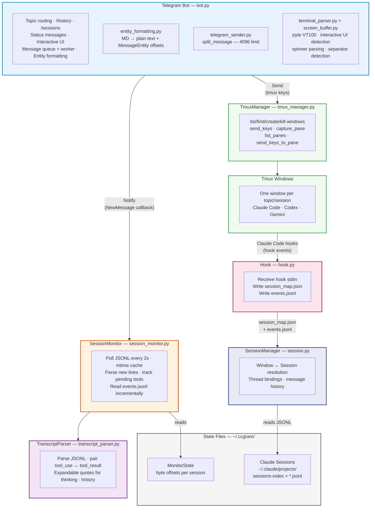

# System Architecture

## Module Inventory

### Provider modules (`providers/`)

| Module        | Description                                                                              |
| ------------- | ---------------------------------------------------------------------------------------- |
| `base.py`     | AgentProvider protocol, ProviderCapabilities, event types                                |
| `registry.py` | ProviderRegistry (name→factory map, singleton cache)                                     |
| `_jsonl.py`   | Shared JSONL parsing base class for Codex + Gemini                                       |
| `claude.py`   | ClaudeProvider (hook, resume, continue, JSONL transcripts)                               |
| `codex.py`    | CodexProvider (resume, continue, JSONL transcripts, no hook)                             |
| `gemini.py`   | GeminiProvider (resume, continue, whole-file JSON transcripts, no hook)                  |
| `__init__.py` | `get_provider_for_window()`, `detect_provider_from_command()`, `get_provider()` fallback |

### Whisper modules (`whisper/`)

| Module                 | Description                                                   |
| ---------------------- | ------------------------------------------------------------- |
| `base.py`              | WhisperTranscriber Protocol + TranscriptionResult dataclass   |
| `httpx_transcriber.py` | OpenAI-compatible transcription via httpx (OpenAI, Groq, etc) |
| `__init__.py`          | Provider factory (`get_transcriber()` from config)            |

### Core modules (`src/ccgram/`)

| Module             | Description                                                          |
| ------------------ | -------------------------------------------------------------------- |
| `cli.py`           | Click-based CLI entry point (run subcommand + all bot-config flags)  |
| `config.py`        | Application configuration singleton (env vars, .env files, defaults) |
| `doctor_cmd.py`    | `ccgram doctor [--fix]` — validate setup without bot token           |
| `status_cmd.py`    | `ccgram status` — show running state without bot token               |
| `screen_buffer.py` | pyte VT100 screen buffer (ANSI→clean lines, separator detection)     |
| `cc_commands.py`   | CC command discovery (skills, custom commands) + menu registration   |
| `screenshot.py`    | Terminal text → PNG rendering (ANSI color, font fallback)            |
| `main.py`          | Application entry point (Click dispatcher, run_bot bootstrap)        |
| `utils.py`         | Shared utilities (ccgram_dir, tmux_session_name, atomic_write_json)  |

### Handler modules (`handlers/`)

| Module                     | Description                                                                           |
| -------------------------- | ------------------------------------------------------------------------------------- |
| `text_handler.py`          | Text message routing (UI guards → unbound → dead → forward)                           |
| `message_sender.py`        | safe_reply/safe_edit/safe_send + rate_limit_send                                      |
| `message_queue.py`         | Per-user queue + worker (merge, status dedup)                                         |
| `status_polling.py`        | Background status polling (1s), RC detection, auto-close, multi-pane scanning         |
| `response_builder.py`      | Response pagination and formatting                                                    |
| `interactive_ui.py`        | AskUserQuestion / ExitPlanMode / Permission UI rendering                              |
| `interactive_callbacks.py` | Callbacks for interactive UI (arrow keys, enter, esc)                                 |
| `directory_browser.py`     | Directory selection UI for new topics                                                 |
| `directory_callbacks.py`   | Callbacks for directory browser (navigate, confirm, provider pick)                    |
| `window_callbacks.py`      | Window picker callbacks (bind, new, cancel)                                           |
| `recovery_callbacks.py`    | Dead window recovery callbacks (fresh, continue, resume)                              |
| `screenshot_callbacks.py`  | Screenshot, status buttons, RC toggle, toolbar, quick-key callbacks                   |
| `history.py`               | Message history display with pagination                                               |
| `history_callbacks.py`     | History pagination callbacks (prev/next)                                              |
| `sessions_dashboard.py`    | /sessions command: active session overview + kill                                     |
| `restore_command.py`       | /restore command: recover dead topics via recovery keyboard                           |
| `resume_command.py`        | /resume command: scan past sessions, paginated picker                                 |
| `upgrade.py`               | /upgrade command: uv tool upgrade + process restart                                   |
| `file_handler.py`          | Photo/document handler (save to .ccgram-uploads/, notify agent)                       |
| `voice_handler.py`         | Voice message download, transcription, confirm keyboard                               |
| `voice_callbacks.py`       | Voice callback routing (vc:send/vc:drop actions)                                      |
| `command_history.py`       | Per-user/per-topic in-memory command recall (max 20)                                  |
| `topic_emoji.py`           | Topic name emoji updates (active/idle/done/dead + RC/YOLO badges), debounced          |
| `hook_events.py`           | Hook event dispatcher (Stop, StopFailure, SessionEnd, Notification, Subagent*, Team*) |
| `cleanup.py`               | Centralized topic state cleanup on close/delete                                       |
| `callback_data.py`         | CB\_\* callback data constants for inline keyboard routing                            |
| `callback_helpers.py`      | Shared helpers (user_owns_window, get_thread_id)                                      |
| `user_state.py`            | context.user_data string key constants                                                |

### State files (`~/.ccgram/` or `$CCBOT_DIR/`)

| File                 | Description                                                    |
| -------------------- | -------------------------------------------------------------- |
| `state.json`         | Thread bindings + window states + display names + read offsets |
| `session_map.json`   | Hook-generated window_id→session mapping                       |
| `events.jsonl`       | Append-only hook event log (all hook events)                   |
| `monitor_state.json` | Poll progress (byte offset) per JSONL file                     |

## Key Design Decisions

- **Topic-centric** — Each Telegram topic binds to one tmux window. No centralized session list; topics _are_ the session list.
- **Window ID-centric** — All internal state keyed by tmux window ID (e.g. `@0`, `@12`), not window names. Window IDs are guaranteed unique within a tmux server session. Window names are kept as display names via `window_display_names` map. Same directory can have multiple windows.
- **Hook-based event system** — Claude Code hooks (SessionStart, Notification, Stop, StopFailure, SessionEnd, SubagentStart, SubagentStop, TeammateIdle, TaskCompleted) write to `session_map.json` and `events.jsonl`. SessionMonitor reads both: session_map for session tracking, events.jsonl for instant event dispatch (interactive UI, done detection, API error alerting, session lifecycle, subagent status, team notifications). Terminal scraping remains as fallback. Missing hooks are detected at startup with an actionable warning.
- **Multi-pane awareness** — Windows with multiple panes (e.g. Claude Code agent teams) are scanned for interactive prompts in non-active panes. Blocked panes are auto-surfaced as inline keyboard alerts. `/panes` command lists all panes with status and per-pane screenshot buttons. Callback data format extended to include pane_id: `"aq:enter:@12:%5"`.
- **Tool use ↔ tool result pairing** — `tool_use_id` tracked across poll cycles; tool result edits the original tool_use Telegram message in-place.
- **Entity-based formatting** — All messages go through `safe_reply`/`safe_edit`/`safe_send` which convert markdown to plain text + `MessageEntity` offsets via `telegramify-markdown`, falling back to plain text on failure. No parse errors possible.
- **No truncation at parse layer** — Full content preserved; splitting at send layer respects Telegram's 4096 char limit with expandable quote atomicity.
- Only sessions registered in `session_map.json` (via hook) are monitored.
- Notifications delivered to users via thread bindings (topic → window_id → session).
- **Startup re-resolution** — Window IDs reset on tmux server restart. On startup, `resolve_stale_ids()` matches persisted display names against live windows to re-map IDs. Old state.json files keyed by window name are auto-migrated.
- **Per-window provider** — All CLI-specific behavior (launch args, transcript parsing, terminal status, command discovery) is delegated to an `AgentProvider` protocol. Providers declare capabilities (`ProviderCapabilities`) that gate UX features per-window: hook checks, resume/continue buttons, and command registration. Each window stores its `provider_name` in `WindowState`; `get_provider_for_window(window_id)` resolves the correct provider instance, falling back to the config default. Externally created windows are auto-detected via `detect_provider_from_command(pane_current_command)`. The global `get_provider()` singleton remains for CLI commands (`doctor`, `status`) that lack window context.
- **Foreign window support (emdash)** — Windows owned by external tools (emdash) use qualified IDs like `emdash-claude-main-abc123:@0` which are valid tmux `-t` targets. Foreign windows are marked `WindowState.external=True` and are never killed by ccgram. Discovery via `tmux list-sessions` filtered by `emdash-` prefix. The `window_resolver` preserves foreign entries during startup re-resolution. All tmux operations (send_keys, capture_pane) route foreign IDs through subprocess instead of libtmux.
