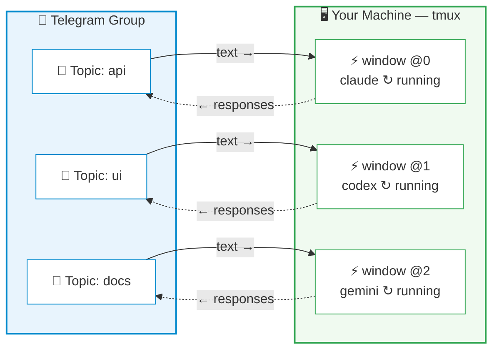

# CCGram — Command & Control Bot

[](https://github.com/alexei-led/ccgram/actions/workflows/ci.yml)
[](https://pypi.org/project/ccgram/)
[](https://pypi.org/project/ccgram/)
[](https://pypi.org/project/ccgram/)
[](https://pypi.org/project/ccgram/)
[](LICENSE)
[](https://github.com/astral-sh/ruff)

Control AI coding agents from your phone. CCGram bridges Telegram to tmux — monitor output, respond to prompts, and manage sessions without touching your computer. Supports [Claude Code](https://docs.anthropic.com/en/docs/claude-code), [Codex CLI](https://github.com/openai/codex), and [Gemini CLI](https://github.com/google-gemini/gemini-cli).

## Why CCGram?

AI coding agents run in your terminal. When you step away — commuting, on the couch, or just away from your desk — the session keeps working, but you lose visibility and control.

CCGram fixes this. The key insight: it operates on **tmux**, not any agent's SDK. Your agent process stays exactly where it is, in a tmux window on your machine. CCGram reads its output and sends keystrokes to it. This means:

- **Desktop to phone, mid-conversation** — your agent is working on a refactor? Walk away and keep monitoring from Telegram
- **Phone back to desktop, anytime** — `tmux attach` and you're back in the terminal with full scrollback
- **Multiple sessions in parallel** — Each Telegram topic maps to a separate tmux window, each can run a different agent

Other Telegram bots wrap agent SDKs to create isolated API sessions that can't be resumed in your terminal. CCGram is different — it's a thin control layer over tmux, so the terminal remains the source of truth.

## How It Works



Each Telegram Forum topic binds to one tmux window running an agent CLI. Messages you type in the topic are sent as keystrokes to the tmux pane; the agent's output is parsed from session transcripts and delivered back as Telegram messages.

## Features

**Session control**

- Send messages directly to your agent topic
- `/commands` shows commands supported by that topic's provider (Claude/Codex/Gemini)
- Forwarded slash commands report provider mismatch errors (for example Claude-only `/cost` in Codex)
- Command menu auto-switches per user/chat to the active topic provider after interaction
- Interactive prompts (AskUserQuestion, ExitPlanMode, Permission) rendered as inline keyboards
- Codex edit approvals are reformatted for Telegram readability (compact summary + short preview, with approval choices preserved)
- Codex `/status` replies include a bot-side transcript snapshot (session + token/rate-limit stats) when Codex does not emit a normal transcript message
- Multi-pane support — auto-detects blocked panes, surfaces prompts, `/panes` command for overview
- Terminal screenshots — capture the current pane (or any specific pane) as a PNG image
- Voice message transcription via Whisper API (OpenAI, Groq) with confirm/discard keyboard
- Sessions dashboard (`/sessions`) — overview of all sessions with status and kill buttons
- Remote Control detection — 📡 topic badge when RC is active, one-tap activation from status keyboard
- Action toolbar (`/toolbar`) — persistent inline buttons for RC, Screenshot, Esc, Notify, Ctrl-C

**Real-time monitoring**

- Assistant responses, thinking content, tool use/result pairs, and command output
- Live status line showing what the agent is currently doing
- Entity-based formatting with automatic plain text fallback

**Session management**

- Directory browser for creating new sessions from Telegram
- Auto-sync: create a tmux window manually and the bot auto-creates a matching topic
- Fresh/Continue/Resume recovery when a session dies
- Message history with paginated browsing (`/history`)
- Persistent state — bindings and read offsets survive restarts

**Multi-provider support**

- Claude Code (default), OpenAI Codex CLI, and Google Gemini CLI
- Per-topic provider selection — different topics can use different agents simultaneously
- Auto-detects provider from externally created tmux windows (process name, with Gemini bun/node wrapper fallback via Gemini pane-title symbols)
- Provider-aware recovery (Continue/Resume buttons adapt to each provider's capabilities)
- [Emdash](https://emdash.ai) integration — auto-discovers emdash tmux sessions; bind Telegram topics to emdash-managed agents with zero configuration

**Extensibility**

- Global Telegram menu includes bot commands + default provider commands (with `↗` prefix); provider-scoped menus auto-refresh per chat/user/topic context with Telegram-scope fallbacks
- Tmux session auto-detection — when running inside tmux, auto-discovers the session and picks up existing agent windows; duplicate instance prevention
- Multi-instance support — run separate bots per Telegram group on the same machine
- Configurable via environment variables

## Quick Start

### Prerequisites

- **Python 3.14+**
- **tmux** — installed and in PATH
- **At least one agent CLI** — `claude` (default), `codex`, or `gemini` installed and authenticated

### Install

```bash
# Recommended
uv tool install ccgram

# Alternatives
pipx install ccgram                   # pipx
brew install alexei-led/tap/ccgram    # Homebrew (macOS)
```

### Configure

1. Create a Telegram bot via [@BotFather](https://t.me/BotFather)
2. Configure bot settings in BotFather:
   - **Allow Groups**: Enabled (Bot Settings > Groups & Channels > Allow Groups? > Turn on)
   - **Group Privacy**: Disabled (Bot Settings > Groups & Channels > Group Privacy > Turn off) — _Required to see all messages in topics_
   - **Topics**: Enabled (Bot Settings > Groups & Channels > Edit Topics > Enable)
3. Add the bot to a Telegram group with Topics enabled.
4. **Promote the bot to Administrator** and ensure it has the **Create Topics** permission (required for the bot to automatically sync and manage session topics).
5. Create `~/.ccgram/.env`:

```ini
TELEGRAM_BOT_TOKEN=your_bot_token_here
ALLOWED_USERS=your_telegram_user_id
CCGRAM_GROUP_ID=your_telegram_group_id
```

> Get your user ID from [@userinfobot](https://t.me/userinfobot) on Telegram.
> Get the group ID by adding -100 in front of the **Peer ID** found in the Group Info (or use [@RawDataBot](https://t.me/RawDataBot)).

### Install hooks (Claude Code only)

```bash
ccgram hook --install
```

This registers Claude Code hooks (SessionStart, Notification, Stop, StopFailure, SessionEnd, SubagentStart, SubagentStop, TeammateIdle, TaskCompleted) for automatic session tracking, instant interactive UI detection, API error alerting, session lifecycle cleanup, and agent team notifications. Not needed for Codex or Gemini — those providers are discovered from hookless transcripts and tmux window/provider detection.

> If hooks are missing, ccgram warns at startup with the fix command. Hooks are optional — terminal scraping works as fallback.

### Run

```bash
ccgram
```

Open your Telegram group, create a new topic, send a message — a directory browser appears. Pick a project directory, choose your agent (Claude, Codex, or Gemini), then choose session mode (`✅ Standard` or `🚀 YOLO`), and you're connected.

## Migrating from ccbot

CCGram was previously named `ccbot`. If upgrading from v1.x:

```bash
# Install new package
pip install ccgram   # or: brew install alexei-led/tap/ccgram

# Migrate config directory
mv ~/.ccbot ~/.ccgram

# Update environment variables: CCBOT_* → CCGRAM_*
# Old CCBOT_* vars still work as fallback with deprecation warnings

# Re-install hooks (replaces legacy "ccbot hook" entries)
ccgram hook --install
```

## Documentation

See **[docs/guides.md](docs/guides.md)** for CLI reference, configuration, upgrading, multi-instance setup, session recovery, testing, and more.

## Development

```bash
git clone https://github.com/alexei-led/ccgram.git
cd ccgram
uv sync --extra dev

make check        # fmt + lint + typecheck + unit + integration tests
make test-e2e     # E2E tests (requires agent CLIs, see docs/guides.md)
```

## Acknowledgments

CCGram started as a fork of [ccbot](https://github.com/six-ddc/ccbot) by [six-ddc](https://github.com/six-ddc), who created the original Telegram-to-Claude-Code bridge. This project has since been rewritten and developed independently with multi-provider support, topic-based architecture, interactive UI, and a comprehensive test suite. Thanks to six-ddc for the initial idea and implementation.

## License

[MIT](LICENSE)
